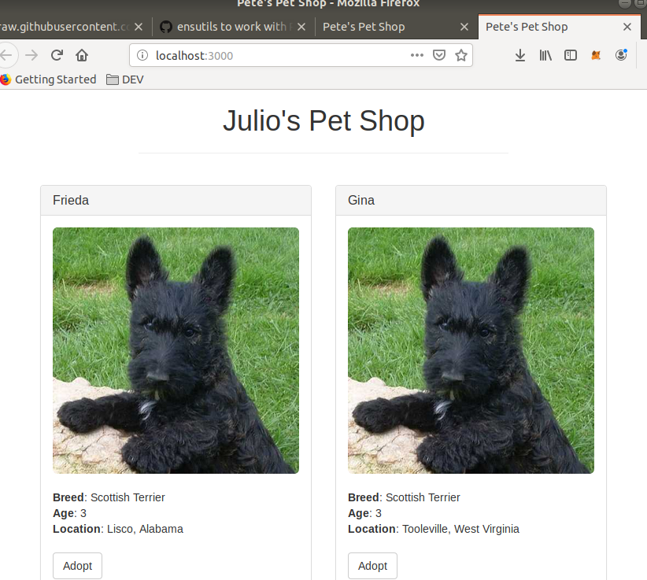
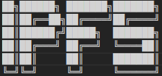
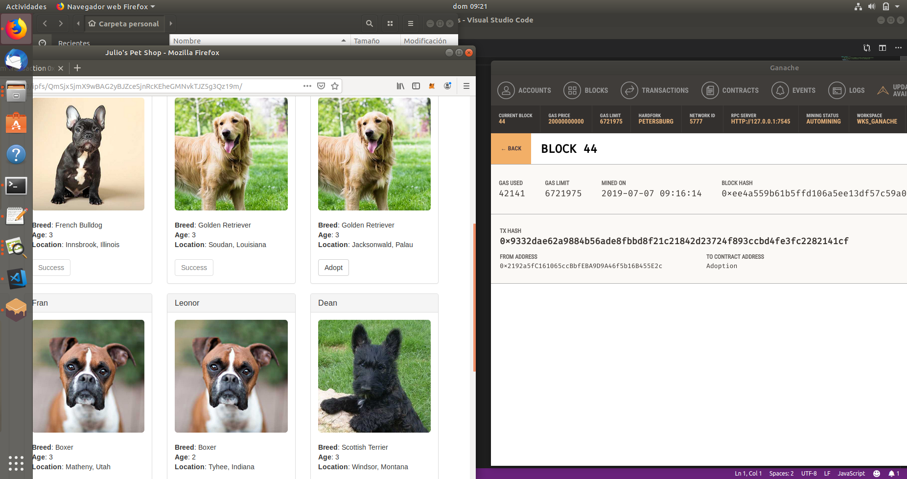

# Ejercicio 2 - IPFS (3 puntos)
*A partir de un truffle project como puede ser la pet-shop utilizada en bloques anteriores.*
*También puede utilizar otro truffle project. Haga una pequeña modificación en su frontend para mostrar su nombre al ejecutar la*
*aplicación. (Puede editar cualquier parámetro adicional, siempre y cuando el nombre sea visible).*
*Suba el truffle project a GitHub manteniendo su estructura. (No incluya la carpeta node_modules).*
*Arranque un daemon de IPFS y aloje la DApp (Proyecto truffle elegido).*
*Una vez alojada la DApp, debe ser capaz de utilizar la aplicación al igual que en localhost, es decir, firmando transacciones mediante MetaMask.*
*Describa todo el procedimiento adjuntando las instrucciones utilizadas y sus outputs,*
*además adjunte el hash de IPFS. Se recomienda realizar la carga (o recarga si ya ha*
*realizado la carga en IPFS) en una fecha cercana a la entrega. Esto es debido a que si*
*realiza la carga en una fecha temprana, puede que el contenido tarde o no llegue incluso*
*a cargar. También debe indicar si los contratos están desplegados en Ganache o Rinkeby.*
*Se recomienda alojar el contenido a subir en IPFS en una única carpeta, ésta también debe alojarse en GitHub.*

Variando el fichero .html podriamos añadir nuevas etiquetas o modificar la que ya existe para añadir mi nombre:

  

 

El proyecto Julios Pet Shop puede verse aqui
[El proyecto Julios Pet Shop puede verse aqui](https://github.com/jcmoya/Desarrollo_UAH/tree/master/PEC2/Ejercicio_2/pet-shop-tutorial "Julio Pet Shop")

## Instalar IPFS

Descargar el paquete, y mediante el terminal:
```
https://dist.ipfs.io/#go-ipfs


jules@jules-VirtualBox:~/Descargas$ tar xvfz 
go-ipfs_v0.4.21_linux-amd64.tar.gz 
go-ipfs/install.sh  
go-ipfs/ipfs  
go-ipfs/LICENSE  
go-ipfs/README.md  

jules@jules-VirtualBox:~/Descargas$ cd go-ipfs  
jules@jules-VirtualBox:~/Descargas/go-ipfs$ sudo ./install.sh  
[sudo] contraseña para jules:  
Moved ./ipfs to /usr/local/bin


//Requisito tener instalado tb go
//Despues hay que inicializar ipfs

jules@jules-VirtualBox:~/Descargas/go-ipfs$ ipfs init  
initializing IPFS node at /home/jules/.ipfs  
generating 2048-bit RSA keypair...done  
peer identity: Qmc9e8hTAiHNUEeaupGLMSxF1t352twgda4XgfxjSs9hGF  
to get started, enter:

	ipfs cat /ipfs/QmS4ustL54uo8FzR9455qaxZwuMiUhyvMcX9Ba8nUH4uVv/readme

jules@jules-VirtualBox:~/Descargas/go-ipfs$ ipfs cat /ipfs/QmS4ustL54uo8FzR9455qaxZwuMiUhyvMcX9Ba8nUH4uVv/readme
Hello and Welcome to IPFS!
```


```
If you're seeing this, you have successfully installed
IPFS and are now interfacing with the ipfs merkledag!

 -------------------------------------------------------
| Warning:                                              |
|   This is alpha software. Use at your own discretion! |
|   Much is missing or lacking polish. There are bugs.  |
|   Not yet secure. Read the security notes for more.   |
 -------------------------------------------------------

Check out some of the other files in this directory:

  ./about
  ./help
  ./quick-start     <-- usage examples
  ./readme          <-- this file
  ./security-notes
```

Para poder dejar a ipfs corriendo por debajo ejecutamos ipfs como un servicio daemon que va a estar corriendo por debajo:
```
jules@jules-VirtualBox:~/Descargas/go-ipfs$ ipfs daemon
Initializing daemon...
go-ipfs version: 0.4.21-
Repo version: 7
System version: amd64/linux
Golang version: go1.12.5
Swarm listening on /ip4/10.0.2.15/tcp/4001
Swarm listening on /ip4/127.0.0.1/tcp/4001
Swarm listening on /ip6/::1/tcp/4001
Swarm listening on /p2p-circuit
Swarm announcing /ip4/10.0.2.15/tcp/4001
Swarm announcing /ip4/127.0.0.1/tcp/4001
Swarm announcing /ip6/::1/tcp/4001
API server listening on /ip4/127.0.0.1/tcp/5001
WebUI: http://127.0.0.1:5001/webui
Gateway (readonly) server listening on /ip4/127.0.0.1/tcp/8080
Daemon is ready
```

//Ahora ya estamos corriendo un nodo de ipfs.
//Desde otro terminal se pudedn ver a los nodos a los que estoy conectado:
//<transport address>/ipfs/<hash-of-public-key>.
```
jules@jules-VirtualBox:~/Descargas/go-ipfs$ ipfs swarm peers
/ip4/113.105.170.13/tcp/14007/ipfs/QmZRdTTKnPNSx7fF6AbAMa2Abf5zUbBzw96n3xStDDzxsQ
/ip4/113.105.170.232/tcp/24005/ipfs/QmRR1HW5cpppDuc9CHkewq3szT1ix1d3ski4DTT1bngnGS
/ip4/113.105.170.54/tcp/14002/ipfs/QmX2Hdfq8f1NRTjandVzeaJ49ESsAgECc3wnX9nqvML3io
/ip4/113.105.170.8/tcp/14007/ipfs/QmT92suW4BnZE5jYqjQiykjUeE4QTNqVTCutmN5Lp2Qpte
/ip4/114.230.67.186/tcp/33091/ipfs/QmbYThJrLyuKX5YzkWwrgH7hjVfiqLcrN7oruGGcqzXmjm
/ip4/115.238.154.84/tcp/20850/ipfs/QmUNDRAoykdF98kZZHJ5u6QpzMgxJbUcWUDtbAW2HBLiJR
```
.....
.....


Para añadir el proyecto pet-shop, con el siguiente comando, seguidamente se van añadiendo los hasesh resultantes a los ficheros que he subido.
Hay que añadir en la misma carpeta todos los ficheros que ejecuta la web, los .json de lo contracts, los .js y las imagenes.
Añadir la carpeta src.
Ademas hay que variar el fichero index.html para que no tenga que ir a buscar los .js a ninguna carpeta y el app.js de la misma forma.
```
jules@jules-VirtualBox:~/Escritorio/pet-shop-tutorial$ ipfs add -r src/
added QmPDrjTZwqSWguzPoK1yZ9gU1DqmvqYkry9c2JioF2avdQ src/Adoption.json
added QmamE8gJi1SivKxTZ4Porbu2MUc69KVB5safJ2dD6BSHRN src/Migrations.json
added QmViWZGPYz8tsgyo4UmxZtoFR2b3jh4KWSttxMxCBXw8fH src/app.js
added QmYUaCPwvJWiueRXFSTTv8vdedWWzRhRdn8RMw35e7k67u src/bootstrap.min.css
added QmbrzMumAwEPCoLs6jBdDyHz2TBjpkSFhcCHMT7fBsdFyr src/bootstrap.min.css.map
added QmNXRFREw7waGtKW9uBUze3PkR9E12HeeAQSkZQSiFUJqo src/bootstrap.min.js
added QmacvUkwHXqjqaHevcNXRvTHompuCSXgTwFRxp2yWJQJah src/boxer.jpeg
added QmbQxip7JFpRobjgepTukv3T7saPu6nJCfCA94Tw2ZoYGb src/bs-config.json
added QmWhoNhVUb9bcjuKLB259VYogJpPsJaAe8dern9LK95tVN src/fonts/glyphicons-halflings-regular.eot
added QmbcbjLEC1aHy4j2qvtncevjenYwHjEF4qZ2kK5pRJzDLg src/fonts/glyphicons-halflings-regular.svg
added QmciDEkreBpY2S6Ktg1Zarbsx5K2DmHK59H261Bjr2fnuR src/fonts/glyphicons-halflings-regular.ttf
added QmaYEdLkMnEHVN8HZB2GGETottySZoHh3TnYZERke36PVr src/fonts/glyphicons-halflings-regular.woff
added QmUbUsBQbjJhm5iYba5jqibRr4A6gG3HVczSy5gs5PrMhY src/fonts/glyphicons-halflings-regular.woff2
added QmcCkw63o2kTaMwHhuUtqZ9cqX7rbVGv9wFJD5nwaXkWPv src/french-bulldog.jpeg
added Qmaj7LUwb7T5sMFyznMGS1cAGPyVJL6Vhjwemq4zb1Nbex src/golden-retriever.jpeg
added QmXpEoDtjXgGtiG22acwqCCqNpxG3fe35DL4cUCawZtwSW src/index.html
added QmRVJrD6uWkEts54TCwU8ZC1qwvT4h4SQDRqyrVcmPtZtn src/package-lock.json
added QmVanysn1CnnKjuiH25Q6USYpB8mWyqCf63x87zyFYGSM9 src/package.json
added QmPcw9jGK2WBnHeNRPcEh8NK2y6xxcet4KSEb5nQoZLagF src/pets.json
added QmT3m9b5UDTr9gKgN1xKQfS5fSKAx8AdZCJ1XJxJTii29m src/scottish-terrier.jpeg
added QmNwWQdxodkdvnMdBie7WvF3HpPUNAR34NvA4vXR2u9PVw src/truffle-config.js
added QmZQp29tbdppjqyixxM8L8NjsG4paN4eVW9GxZYicXov9v src/truffle-contract.js
added QmdTtsVM7KtvycQ68f9M43N4EQKvbd58q8aeAhP2fMz4Di src/web3.min.js
added Qmb3fJpXVGvUnNeRLC3P5sTXMzjpf5zq4tKt9XjhtYFf1k src/fonts
added QmTT89hDJJa3adFKv5g82wCMhBWSLVtho6MKFrCxxNk9VB src
```


EL ultimo hash es el que va a ejecutar el fichero index.html, con el que hacer referencia en la url


http://localhost:8080/ipfs/QmTT89hDJJa3adFKv5g82wCMhBWSLVtho6MKFrCxxNk9VB/

Para probar que se pueden firmar transacciones desde metamask y probar los contratos que tenia desplegados en Ganache:

0x9332dae62a9884b56ade8fbbd8f21c21842d23724f893ccbd4fe3fc2282141cf



A traves de otro nodo,  Gateway
 http://gateway.ipfs.io/ipfs/QmTT89hDJJa3adFKv5g82wCMhBWSLVtho6MKFrCxxNk9VB/


## Referencias:

https://docs.ipfs.io/introduction/usage/
https://docs.ipfs.io/guides/examples/websites/


Para transferir algunos ethers a la cuenta de metamask:

> eth.getBalance(eth.coinbase)
2999567563000000000
> web3.eth.sendTransaction({
......     from: "0xa6be4ff596c2cad0f17e34655a9b421e435117f1",
......     to: "0x2192a5fC161065ccBbfEBA9D9A46f5b16B455E2c",
......     value: web3.toWei(1, "ether")
...... })
"0x012f2c73c088c943dc49a27146f0d2506488c014a8917781623a5240cf4714d2"

