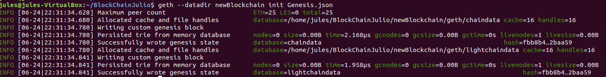
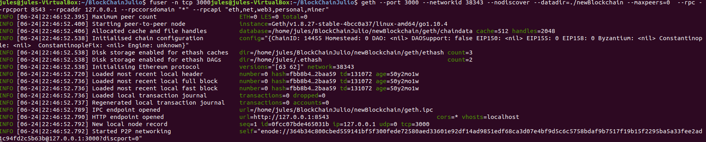
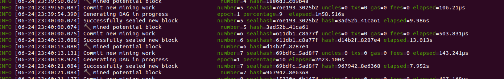
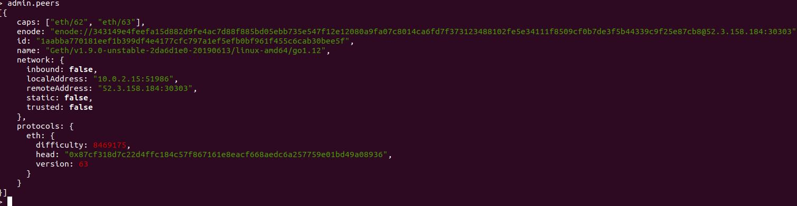
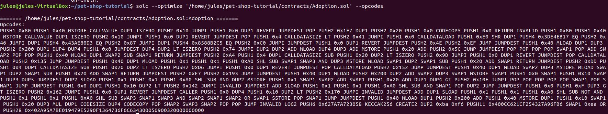
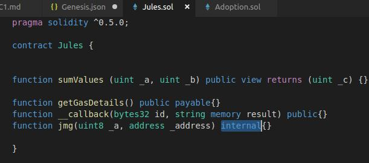

#PEC 1
#Diseño y Desarrollo
##Ejercicio 1 (2 puntos)
**Construya y configure su propia blockchain a partir de un archivo génesis que usted mismo debe definir. Se recomienda el uso del cliente Geth. Cree una cuenta mediante el cliente Geth. Consiga su propio Ether a partir de la minería.**


 - Creas una carpeta y en ella el fichero .json con las caracteristicas de la Blockchain, el primer bloque llamado genesis.
En el estaran enumeradas la caracteristicas principales de esta blockchain:
```
{"config": 
    {"chainId": 14455, //Numero identificando tu Blockchain
"homesteadBlock": 0,
"eip155Block": 0, // Hacen referencia a un par de “Ethereum Improvement Proposals”
"eip158Block": 0
    },
"alloc": {},  //Permite agregar Ethers a cuentas
"difficulty" : "0x20000",
"gasLimit"   : "0x8970000"
}
```
 - Creas una carpeta donde se van a ir guardando los bloques, y ejecutas el cliente geth pasandole como parametro el lugar donde dejar los bloques y el json con el primer bloque
```
jules@jules-VirtualBox:~/BlockChainJulio$ mkdir newBlockchain
jules@jules-VirtualBox:~/BlockChainJulio$ geth --datadir newBlockchain init Genesis.json
```
  

Lanzar la BLockchain:
```
jules@jules-VirtualBox:~/BlockChainJulio$ geth --port 3000 --networkid 38343 --nodiscover --datadir=./newBlockchain --maxpeers=0  --rpc --rpcport 8543 --rpcaddr 127.0.0.1 --rpccorsdomain "*" --rpcapi "eth,net,web3,personal,miner"
```

  


Luego conectas geth con la blockchain desde otro terminal
```
jules@jules-VirtualBox:~/BlockChainJulio$ geth attach http://127.0.0.1:8543
Welcome to the Geth JavaScript console!

instance: Geth/v1.8.27-stable-4bcc0a37/linux-amd64/go1.10.4
 modules: eth:1.0 miner:1.0 net:1.0 personal:1.0 rpc:1.0 web3:1.0
```

Crea una nueva cuenta,el password de la cuenta va entre las comillas
```
> personal.newAccount('seed')
"0x685b3c24ae853da943962980dc2f56488309cf6f"
> personal.newAccount('jules')
"0x58cb1c52d776fba23660c7eb4490dc3ec9442288"
```

Para desbloquear la cuenta:
```
> personal.unlockAccount(web3.eth.coinbase, "seed", 15000)
true
```
Para desbloquear la mia nueva
```
> personal.unlockAccount(eth.accounts[1], "jules", 15000)
true
```
Para minar
```
miner.start(2) //Como argumento le pasas el numero de hilos que vas  
```
adjudicar a la minieria
 

```
> eth.getBalance("0x58cb1c52d776fba23660c7eb4490dc3ec9442288")
50000000000000000000
```


Para saber el numero de cuentas:
```
> eth.accounts
["0x685b3c24ae853da943962980dc2f56488309cf6f", "0x58cb1c52d776fba23660c7eb4490dc3ec9442288", "0x79647399c03f430a6eb3d3e32e8b4ad2c5b3eb47"]
```

Saber cuantos Ethers tienes en una cuenta concreta en weis:
```
> web3.fromWei(eth.getBalance(eth.accounts[1]),"ether")
540
```
##Ejercicio 2 (2 puntos)
**A partir del ejercicio anterior, cree una nueva cuenta en su blockchain.
Realice mediante el propio cliente Geth una transferencia de 1 Ether entre dos cuentas de esta blockchain.**

Enviar 1 Ether a la cuenta

```
> eth.sendTransaction({from: eth.accounts[0], to: eth.accounts[1], value: 1000000000000000000})
"0xef119eddc5c73ec7de3e7fc75c602732b17885ef9bc025b2e09b7b758b0816f5"
> eth.getBalance("0x58cb1c52d776fba23660c7eb4490dc3ec9442288")
0
```

//Hasta que no se genere un bloque no se guardara la transaccion, por eso es necesario minar un bloque:
```
> miner.start(1)
null
> miner.stop()
null

 
> eth.getBalance("0x58cb1c52d776fba23660c7eb4490dc3ec9442288")
1000000000000000000
```
**Realice mediante la consola de Truffle y conectado a una blockchain desplegada con Ganache una transferencia de 1 Ether entre dos cuentas de esta blockchain. Puede aprovechar el entorno creado en la actividad primera del bloque 1 (​ Truffle Pet Shop ​ ).**

Dento del proyecto de PetShop
```
truffle(development)> web3.eth.getBalance('0x40F02D8Cf291fD41156b441100df281BABb1ec99')
'100000000000000000000'
truffle(development)> web3.eth.getBalance('0x9E43AC5eEcfd6319fcA911300A66818F8c5F2909')
'100000000000000000000'
truffle(development)> web3.eth.sendTransaction({from:"0x40F02D8Cf291fD41156b441100df281BABb1ec99", to:"0x9E43AC5eEcfd6319fcA911300A66818F8c5F2909", value: 1000000000000000000})
{ transactionHash: '0x14250f323b5ff6eeccfd4eadb12281e041a418c405e65eede633742428aaa46e',
  transactionIndex: 0,
  blockHash: '0xb2871e2b32e01be06d7f84034ccfd94ad854c158ab4006ce1086317a461e5672',
  blockNumber: 42,
  from: '0x40f02d8cf291fd41156b441100df281babb1ec99',
  to: '0x9e43ac5eecfd6319fca911300a66818f8c5f2909',
  gasUsed: 21000,
  cumulativeGasUsed: 21000,
  contractAddress: null,
  logs: [],
  status: true,
  logsBloom: '0x00000000000000000000000000000000000000000000000000000000000000000000000000000000000000000000000000000000000000000000000000000000000000000000000000000000000000000000000000000000000000000000000000000000000000000000000000000000000000000000000000000000000000000000000000000000000000000000000000000000000000000000000000000000000000000000000000000000000000000000000000000000000000000000000000000000000000000000000000000000000000000000000000000000000000000000000000000000000000000000000000000000000000000000000000000000',
  v: '0x1b',
  r: '0xbf7cd57aef1b1e251900864dc4f0cca9a0cf580e35859718435f7ef0eaf8936a',
  s: '0x740b10ded8b4364402b27e3ad45db39f420e264f6592e9694a348e353c28d081' }

  //El balance de la cuenta ya se ha actualizado
truffle(development)> web3.eth.getBalance('0x9E43AC5eEcfd6319fcA911300A66818F8c5F2909')
'101000000000000000000'

```
##Ejercicio 3 (2 puntos)
**Inicie la sincronización de la red Rinkeby en su dispositivo (se recomienda ésta frente a Ropsten debido al tamaño de la misma y la velocidad de sincronización). Para la realización de este ejercicio no necesita una sincronización completa del nodo.
Obtenga el address correspondiente al bloque génesis de la red Rinkeby mediante
la consola del cliente Geth y demuestre cómo lo ha obtenido. No use la función getBlock(...)​**
```
 geth --rinkeby //Para lanzar el cliente geth con la blockchain de rinkeby

  //Deste otro terminal
jules@jules-VirtualBox:~$ geth --datadir='/home/jules/.ethereum/rinkeby' attach  ipc:'/home/jules/.ethereum/rinkeby/geth.ipc' console
Welcome to the Geth JavaScript console!

instance: Geth/v1.8.27-stable-4bcc0a37/linux-amd64/go1.10.4
coinbase: 0xa6be4ff596c2cad0f17e34655a9b421e435117f1
at block: 4621418 (Tue, 25 Jun 2019 10:24:31 CEST)
 datadir: /home/jules/.ethereum/rinkeby
 modules: admin:1.0 clique:1.0 debug:1.0 eth:1.0 miner:1.0 net:1.0 personal:1.0 rpc:1.0 txpool:1.0 web3:1.0

> admin.nodeInfo //Obtienes la info del nodo que estoy corriendo de Rinkey , en esa info aparece la adressd del bloque genesis:

{
  enode: "enode://8ecb80998231a33aff9db3754e9111115e03ede3682f9eb20ae07a092a201434bfba35a623611d91bf97d92dbf9cd29ee2a85845c334bf591056e5fff336be30@83.56.36.83:30303?discport=43423",
  enr: "0xf89cb84006e67f581aafb93fe9c6b4194f7fb3f82ebabdd4cdcea95c7a8e01a0ce797e2a6712277de4dbc4ad7f21ba0118af12af781beb9f4f4930234631fa317dc8de1e2683636170ccc5836574683ec5836574683f826964827634826970845338245389736563703235366b31a1028ecb80998231a33aff9db3754e9111115e03ede3682f9eb20ae07a092a2014348374637082765f8375647082a99f",
  id: "aa6a69be2b76f3c6fc6eb4cd81695cfefb568722346d194a0f5d218744fb573f",
  ip: "83.56.36.83",
  listenAddr: "[::]:30303",
  name: "Geth/v1.8.27-stable-4bcc0a37/linux-amd64/go1.10.4",
  ports: {
    discovery: 43423,
    listener: 30303
  },
  protocols: {
    eth: {
      config: {
        byzantiumBlock: 1035301,
        chainId: 4,
        clique: {...},
        constantinopleBlock: 3660663,
        daoForkSupport: true,
        eip150Block: 2,
        eip150Hash: "0x9b095b36c15eaf13044373aef8ee0bd3a382a5abb92e402afa44b8249c3a90e9",
        eip155Block: 3,
        eip158Block: 3,
        homesteadBlock: 1,
        petersburgBlock: 4321234
      },
      difficulty: 8459273,
      genesis: "0x6341fd3daf94b748c72ced5a5b26028f2474f5f00d824504e4fa37a75767e177", //Aquí
      head: "0xbba7305007cea6ef9755de227cf0384488c4cd893802aa7071033b5b0bb6da3c",
      network: 4
    }
  }
}
```


- Obtenga sólo la cantidad de peers a los que está conectado. Demuestre cómo lo ha obtenido.
```
> net.peerCount
1

```
- Obtenga información acerca de los peers a los que está conectado e indique el hash del bloque actual de éstos.
Con admin.peers //saber los nodos a los que estoy conectado

 

enodes de la red de Rinkeby a los que puedo conectarme, en este momento sólo uno:

"enode://a24ac7c5484ef4ed0c5eb2d36620ba4e4aa13b8c84684e1b4aab0cebea2ae45cb4d375b77eab56516d34bfbd3c1a833fc51296ff084b770b94fb9028c4d25ccf@52.169.42.101:30303", // IE
	"enode://343149e4feefa15d882d9fe4ac7d88f885bd05ebb735e547f12e12080a9fa07c8014ca6fd7f373123488102fe5e34111f8509cf0b7de3f5b44339c9f25e87cb8@52.3.158.184:30303",  // INFURA
	"enode://b6b28890b006743680c52e64e0d16db57f28124885595fa03a562be1d2bf0f3a1da297d56b13da25fb992888fd556d4c1a27b1f39d531bde7de1921c90061cc6@159.89.28.211:30303", // AKASHA
}

**Añada manualmente mediante la consola de Geth un ​ bootnode ​ de la red Rinkeby.**

Añado Infura enode
```
> admin.addPeer('enode://b6b28890b006743680c52e64e0d16db57f28124885595fa03a562be1d2bf0f3a1da297d56b13da25fb992888fd556d4c1a27b1f39d531bde7de1921c90061cc6@159.89.28.211:30303')
true
```

##Ejercicio 4 (2 puntos)
**
Instale el ​ compilador de Solidity​ (si aún no lo tiene instalado).
Obtenga un contrato inteligente que haya utilizado anteriormente o desarrolle uno tan simple como pueda.**

La version que tengo del compilador:
```
jules@jules-VirtualBox:~/pet-shop-tutorial$ solc --version
solc, the solidity compiler commandline interface
Version: 0.5.9+commit.c68bc34e.Linux.g++
```

**A partir del compilador de Solidity y habilitando siempre la optimización (​ --optimize​ ). Obtenga:**

- Códigos de operación del contrato inteligente.

Usando solc --help //Listado de comandos posibles

 

- Identificadores de las funciones que existan dentro del contrato inteligente.
```
jules@jules-VirtualBox:~/pet-shop-tutorial$ solc --optimize '/home/jules/pet-shop-tutorial/contracts/Adoption.sol' --hashes

======= /home/jules/pet-shop-tutorial/contracts/Adoption.sol:Adoption =======
Function signatures: 
8588b2c5: adopt(uint256)
43ae80d3: adopters(uint256)
3de4eb17: getAdopters()
```

**Estimación del gas utilizado por cada función.**
```
jules@jules-VirtualBox:~/pet-shop-tutorial$ solc --optimize --gas '/home/jules/pet-shop-tutorial/contracts/Adoption.sol' 

======= /home/jules/pet-shop-tutorial/contracts/Adoption.sol:Adoption =======
Gas estimation:
construction:
   147 + 97400 = 97547
external:
   adopt(uint256):	20590
   adopters(uint256):	513
   getAdopters():	infinite
```

##Ejercicio 5 (2 puntos)
**Obtenga sin utilizar el compilador de Solidity el identificador de cada una de las siguientes funciones y justifique cómo los ha obtenido. Muestre mediante un pantallazo la obtención de los identificadores.**
- function sumValues (uint _a, uint _b) public view returns (uint _c) {}
sumValues(uint, uint) 
- function getGasDetails() public payable{}
- function __callback(bytes32 id, string memory result) public{}
- function abr(uint8 _a, address _address) internal{}

**Debe modificar “abr” por sus iniciales (nombre y apellidos).
La resolución del ejercicio se debe realizar aplicando un procedimiento manual, es decir,
sin utilizar herramientas que obtengan automáticamente los identificadores. 
Entrega: Debe entregar un documento .md donde se encuentre la justificación y los identificadores obtenidos. Además en el mismo repositorio debe alojar los pantallazos que considere necesarios.**

El identificador de funcion se saca aplicando el hash Keccack256 al String "nombre de la funcion(TipoValor1, TipoValor2...)" y cogiendo los primeros 4 Bytes.

Sacándolos de manera rápida con el compilador de Solidity, Menos la funcion de tipo internal (que no he podido sacar sin cambiar el tipo)  debieran de dar los siguientes Identificadores de funcion:

 

```
jules@jules-VirtualBox:~/pet-shop-tutorial$ solc --optimize '/home/jules/pet-shop-tutorial/contracts/Jules.sol' --hashes

======= /home/jules/pet-shop-tutorial/contracts/Jules.sol:Jules =======
Function signatures: 
27dc297e: __callback(bytes32,string)
3d86f4af: getGasDetails()
27b57fcc: sumValues(uint256,uint256)
```

Para sacarlo mediante web3 usaré la función:

web3.eth.abi.encodeFunctionSignature(functionName);

 

Referencias:

https://gist.github.com/cryptogoth/10a98e8078cfd69f7ca892ddbdcf26bc
https://github.com/ethereum/go-ethereum/issues/15112
https://medium.com/blockchainbistro/set-up-a-private-ethereum-blockchain-and-deploy-your-first-solidity-smart-contract-on-the-caa8334c343d
https://github.com/ethereum/go-ethereum/wiki/Connecting-to-the-network
https://web3py.readthedocs.io
https://web3js.readthedocs.io/en/1.0/web3-eth-abi.html#encodefunctionsignature
https://medium.com/@piyopiyo/how-to-get-ethereum-encoded-function-signatures-1449e171c840
