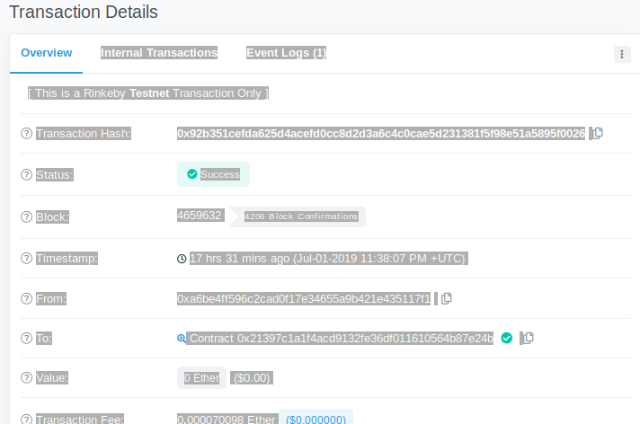

# Ejercicio 1 - ENS (1 punto)
*Adquiera un dominio bajo el TLD ‘.test’ en la testnet Rinkeby.*
*Describa el procedimiento seguido paso a paso.*
*Demuestre que es usted poseedor del dominio adquirido y obtenga la dirección del Resolver utilizado. (Adjunte un pantallazo con todas las instrucciones *utilizadas y sus outputs).*
*Tenga en cuenta que la duración de la propiedad de los dominios en testnet es de 28 días.


Primer paso sincronizar la red Rinkeby
Después descargar una serie de funciones para poder usar ENS desde el terminal, con el fichero ensutils.js, un programa en javascript para poder interactuar con ENS
https://raw.githubusercontent.com/ethereum/ens/master/ensutils.js

Varias el fichero el ENS contract address para poder usar Rinkey

Imagen

Si usas mainet:

```
    ENS on Mainnet: 0x314159265dd8dbb310642f98f50c066173c1259b
```


Arrancas Geth en otro termina , Por supuesto la red de Rinkeby esta levantada:

```
jules@jules-VirtualBox:~$ geth --datadir='/home/jules/.ethereum/rinkeby' attach  ipc:'/home/jules/.ethereum/rinkeby/geth.ipc' console
Welcome to the Geth JavaScript console!
```

Cargas el fichero .js en gethte dara este error:

```
> loadScript('/home/jules/Escritorio/ensutils.js')
err: Error: invalid address
false
```

Hay que variar el .js para que apunte a la red ENS de Rinkeby: 0xe7410170f87102df0055eb195163a03b7f2bff4a
```
> loadScript('/home/jules/Escritorio/ensutils.js')
true
```

Ahora haciendo uso de ciertas funciones del script miras a ver si el dominio esta libre:
```
> testRegistrar.expiryTimes(web3.sha3("moyagonzalez"))
0
```

Si devuelve un 0 es que sí esta disponible.
Ahora neceitas comprar el dominio, para ello es ncesario de disponer de una cuenta en Rinkeby con algunos ethers.

```
> eth.getBalance(eth.coinbase)
3000000000000000000
> personal.unlockAccount(eth.coinbase) //Desbloqueamos la cuenta con el password
Unlock account 0xa6be4ff596c2cad0f17e34655a9b421e435117f1
Passphrase: 
true

> testRegistrar.register(web3.sha3("moyagonzalez"), eth.coinbase, {from: eth.coinbase})
"0x92b351cefda625d4acefd0cc8d2d3a6c4c0cae5d231381f5f98e51a5895f0026"

```
El último número es el número de la transacción donde he adquirido el dominio, en el siguiente bloque debiera de estar.



Para saber el tiempo en que va a expirar mi domninio:
```
> testRegistrar.expiryTimes(web3.sha3("moyagonzalez"))
1564443487
```

Para saber quien es el propietario del dominio:
```
> ens.owner(namehash("moyagonzalez.test"))
"0xa6be4ff596c2cad0f17e34655a9b421e435117f1" //Esta será la bzzaccount (tenerlo en cuenta para el ejercicio de swarm :) )
```
Que es mi cuenta eth.coinbase
imagen ens.moyagonzalez.png.

Ahora hacemos el Resolver del dominio que hemos adquirido

> personal.unlockAccount(eth.accounts[0])
Unlock account 0xa6be4ff596c2cad0f17e34655a9b421e435117f1
Passphrase: 
true

He desplegado un contrato usando REMIX cuya transaccion es la siguiente:
publicResolver = resolverContract.at("0x692a70d2e424a56d2c6c27aa97d1a86395877b3a")


Ahora le asigmamos esa direccion del contrato al dominio que he cogido

> personal.unlockAccount(eth.accounts[0])
Unlock account 0xa6be4ff596c2cad0f17e34655a9b421e435117f1
Passphrase: 
true
> ens.setResolver(namehash('moyagonzalez.test'),publicResolver.address,{from:eth.accounts[0], gas: 100000})
"0x95d8a4f667f0c8b9a24bdfbe22d08a0010c52f3de02636cfe6fa9c7279b0640c"


Esta ultima transaccion no he podido verificarla en Etherscan, quizas un poco mas tarde aparezca

PAra verificar el resolver, y que el contrato apunta al dominio:
> ens.resolver(namehash("moyagonzalez.test"))
"0x5d20cf83cb385e06d2f2a892f9322cd4933eacdc"

Tambien se puede usar el resolver para apuntar a una cuenta, de ese modo es mas facil poder realizar pagos, ya que el domnio que he cogido seria mi cuenta:

> personal.unlockAccount(eth.accounts[0])
Unlock account 0xa6be4ff596c2cad0f17e34655a9b421e435117f1
Passphrase: 
true
> publicResolver.setAddr(namehash("moyagonzalez.test"), eth.accounts[0], {from: eth.accounts[0]})
"0x9c8b91544849f555219c3034f9a2160b0a9eeb830a6eed924e597999395cf11c" 

a la hora de ver 


siempre me devolvia 
0x000....
En el servidor de Rinkeby devolvia la traza siguiente:

WARN [07-07|20:27:42.561] Synchronisation failed, dropping peer    peer=1aabba770181eef1 err="retrieved hash chain is invalid"

parece ser que necesitaba instalar un servicio para mantener el reloj
jules@jules-VirtualBox:~$ sudo apt-get install ntp
jules@jules-VirtualBox:~$ sudo service ntp start
jules@jules-VirtualBox:~$ geth --rinkeby --syncmode "fast" 

Una zez lo he hecho, ya con el getAddr('moyagonzalez.test) ya devuelve mi cuenta
imagen getAddre_moyagonzalez.png


//Referencias
https://michalzalecki.com/register-test-domain-with-ens/
https://medium.com/@codeAMT/registering-test-domains-for-your-dapps-65da98d5386f

