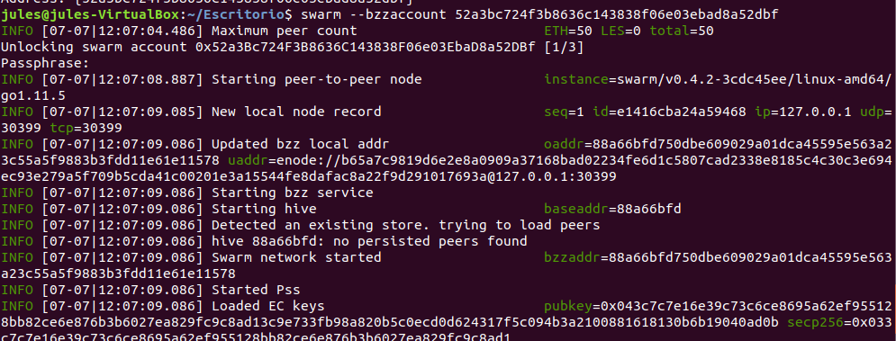

# Ejercicio 3 - SWARM (2 puntos)
*Cree una página web básica (archivo HTML) en la cual se muestren los vínculos a dos archivos distintos alojados en Swarm además de su nombre.*
*En la subida de los archivos debe utilizar el cifrado disponible en Swarm. No se considerará válido si se suben los contenidos por separado y se *vinculan en el archivo HTML posteriormente. Al navegar entre los archivos, el hash de Swarm mostrado en la barra de direcciones no debe cambiar.*
*La respuesta a este ejercicio debe ser algo de este estilo:*

  

No es necesario vincular el hash de Swarm a ENS.


Primero instalamos swarm en la máquina:

```
jules@jules-VirtualBox:~/Escritorio$ sudo apt-get install ethereum-swarm  
Leyendo lista de paquetes... Hecho  
Creando árbol de dependencias  
Leyendo la información de estado... Hecho  
Se instalarán los siguientes paquetes NUEVOS:
  ethereum-swarm  
  0 actualizados, 1 nuevos se instalarán, 0 para eliminar y 267 no actualizados.  
Se necesita descargar 7.190 kB de archivos.
Se utilizarán 28,4 MB de espacio de disco adicional después de esta operación.  
Des:1 http://ppa.launchpad.net/ethereum/ethereum/ubuntu bionic/main amd64 ethereum-swarm amd64 0.4.2+build5368+bionic [7.190 kB]  
Descargados 7.190 kB en 1s (11,2 MB/s)  
Seleccionando el paquete ethereum-swarm previamente no seleccionado.  
(Leyendo la base de datos ... 169962 ficheros o directorios instalados actualmente.)
Preparando para desempaquetar .../ethereum-swarm_0.4.2+build5368+bionic_amd64.deb ...  
Desempaquetando ethereum-swarm (0.4.2+build5368+bionic) ...  
Configurando ethereum-swarm (0.4.2+build5368+bionic) ...  
jules@jules-VirtualBox:~/Escritorio$ swarm version  
Swarm
Version: 0.4.2-stable  
Git Commit: 3cdc45ee0fadc000ec3dbbe87225f18061402527  
Go Version: go1.11.5  
OS: linux
```

Creas una nueva cuenta del cliente de geth
```
jules@jules-VirtualBox:~/Escritorio$ geth account new
INFO [07-07|12:05:04.929] Maximum peer count                       ETH=25 LES=0 total=25  
Your new account is locked with a password. Please give a password. Do not forget this password.  
Passphrase: 
Repeat passphrase:  
Address: {52a3bc724f3b8636c143838f06e03ebad8a52dbf}
```

```
swarm --bzzaccount 52a3bc724f3b8636c143838f06e03ebad8a52dbf //Este punto es el que me llevo tanto tiempo de descubrir, luego en el ejercicio 4 habria que usar la cuenta de geth con la que registre el dominio y no usar esta nueva cuenta que habia creado.
```

  

swarm te levanta un servidor con un API http

http://localhost:8500


  


Desde otro ternminal lanzas geth para interactuar con swarm:
```
jules@jules-VirtualBox:~/Escritorio$ geth attach $HOME/.ethereum/bzzd.ipc
Welcome to the Geth JavaScript console!
```
instance: swarm/v0.4.2-3cdc45ee/linux-amd64/go1.11.5  
modules: accounting:1.0 admin:1.0 bzz:1.0 chequebook:1.0 debug:1.0 hive:1.0 pss:1.0 rpc:1.0 stream:1.0 swarmfs:1.0 web3:1.0


Después se crea el fichero .html donde se hace referencia a los dos ficheros que voy a referenciar, una imagen y un texto. Y
 que voy a subir a Swarm.:

```html
<html> 
    <head>
    <title>Ejercicio 3 - PEC2 - Swarm</title>  
    </head>
    <body> 
        <ul>
            <li><a href="dir1/ECCEHOMO.jpg">Documento 1</a> Julio Moya </li>
            <li><a href="dir2/Test_1.txt">Documento 2</a> Julio Moya </li>
            
            </ul>
            
    </body> 
</html>
```

Seguidamente se crea una carpeta donde se va a contener el .html, y dento otras dos carpetas donde se van a incluir los otros dos ficheros
  

Desde el terminal, y posicionándome donde estan las carpetas se hace uso del comando de subida de swarm a la red más --recursive, que subira todo el contenido que esta contenido dentro de la carpeta, y --encrypt para encripar el contenido, tal como dice el enunciado.  
Esto devolvera un hash univoco del contenido:

```
jules@jules-VirtualBox:~/Escritorio$ swarm --defaultpath Test_Swarm/Ejercicio3.html --recursive up --encrypt Test_Swarm  
27f9782edaac4b92b10b0b0046b7fb69c6800d08037297786a8bc7b93bf203e5de3a3820b2f5b9c98d3b748aedbaa60f3e6a493d7627e114c34577a0528d2590
```

  


Ahora desde mi navegador se puede acceder al contenido ya colgado en la red:

```
http://localhost:8500/bzz:/1e2bb895495982d8894fb984363f2112553f60d24bef67e76781c44c6d77ca9e6faee16d7c5b928d9f245c33450f682e752a86724571b3152def58910f8d5f4b/Ejercicio3.html
```

Para acceder directamente con el hash que devuelve swarm se tiene que subir los ficheros dándole el punto de entrada al .html.
De la siguiente manera ya reconoceria directamente el .html


Con el *cdfaultpath* de esa manera se podría usar sin indicarle el .html:
http://localhost:8500/bzz:/27f9782edaac4b92b10b0b0046b7fb69c6800d08037297786a8bc7b93bf203e5de3a3820b2f5b9c98d3b748aedbaa60f3e6a493d7627e114c34577a0528d2590


 


Referencias:
https://swarm-guide.readthedocs.io/en/latest/up-and-download.html
https://swarm-guide.readthedocs.io/en/latest/usage.html


