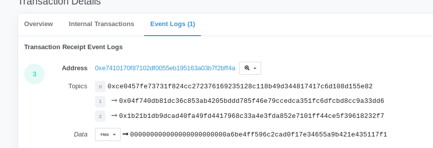
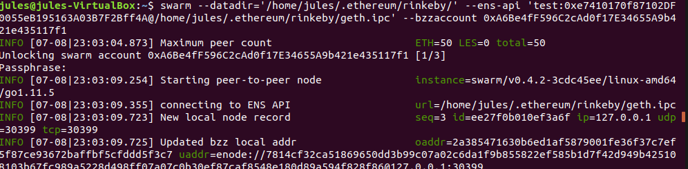
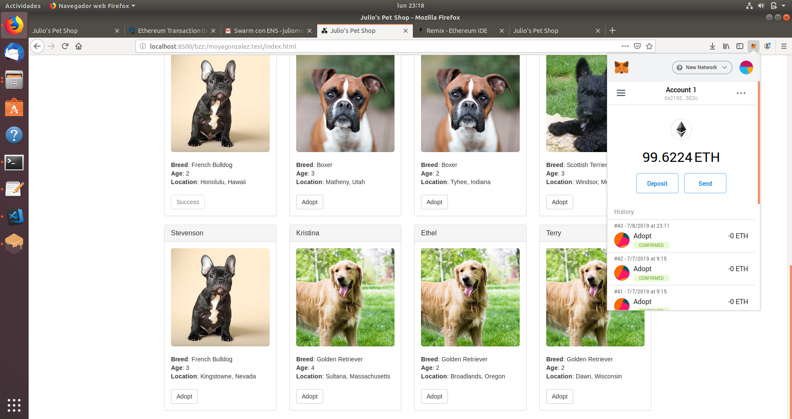

# Ejercicio 4 - SWARM (4 puntos)
*Puede reutilizar parte de lo que ha realizado en el ejercicio 2 (hasta subir el proyecto a GitHub).*
*Arranque un nodo de Swarm y aloje la DApp (Proyecto truffle elegido).*
*Además, vincule el ENS adquirido en el ejercicio 1 con la DApp, de tal forma que una url como la de a continuación muestre la aplicación. Por ejemplo:*
http://localhost:8500/bzz:/swarmtest.test/index.html  

*Una vez alojada la DApp, debe ser capaz de utilizar la aplicación al igual que en localhost, es decir, firmando transacciones mediante MetaMask.*
*Adjunte el hash de Swarm asociado con la aplicación.*
*Describa todo el procedimiento adjuntando las instrucciones utilizadas y sus outputs. Adjunte todos los pantallazos que considere relevantes (como *puede ser el navegador mostrando la aplicación o transacciones de MetaMask, entre otros) e indique las direcciones de los contratos en la red *correspondiente (Rinkeby, Ropsten...).*


Tener la blockchain de Rinkeby abierta:
```
jules@jules-VirtualBox:~$ geth --rinkeby --syncmode "fast" 
INFO [07-08|19:24:26.758] Maximum peer count                       ETH=25 LES=0 total=25
INFO [07-08|19:24:26.765] Starting peer-to-peer node               instance=Geth/v1.8.27-stable-4bcc0a37/linux-amd64/go1.10.4
```
En otro terminal, ejecutas geth:  
```
> jules@jules-VirtualBox:~$ geth --datadir='/home/jules/.ethereum/rinkeby' attach  ipc:'/home/les/.ethereum/rinkeby/geth.ipc' console
Welcome to the Geth JavaScript console!
```
Desbloqueas la cuenta con la que compraste el domninio, en mi caso "moyagonzalez.test" y cargas el scritp de ensutils.js
```
> personal.unlockAccount(eth.accounts[0])  
Unlock account 0xa6be4ff596c2cad0f17e34655a9b421e435117f1  
Passphrase: 
true
> loadScript('/home/jules/Escritorio/ensutils.js')  
true

> ens.owner(namehash("moyagonzalez.test"))
"0xa6be4ff596c2cad0f17e34655a9b421e435117f1" //Esta es la cuenta de geth importante a usar despues
```

Ahora, es ncesario desplegar los contratos que usa Pet-shop : Migration y Adoption.sol  
[Desplegar Contratos en Rinkeby a través de Truffle](http://www.limni.net)
Lo hago con Truffle. Primero se edita truffleconfig.js para que se conecte a rinkeby con la siguientes características, y forzar a usar mi cuenta eth.coinbase

```json
module.exports = {
  networks: {
    development: {
      host: "localhost",
      port: 8545,
      network_id: "*" // Match any network id
    },
    rinkeby: {
      host: "localhost", // Connect to geth on the specified
      port: 8545,
      from: "0xa6be4ff596c2cad0f17e34655a9b421e435117f1", // default address to use for any transaction Truffle makes during migrations
      network_id: 4,
      gas: 4612388 // Gas limit used for deploys
    }
  }
};
```
Hay que conectar Swarm y relacionar la con la cuenta de geth  y el ENS registry address. Esta última dirección viene de cuando registre el dominio

```
> testRegistrar.register(web3.sha3("moyagonzalez"), eth.coinbase, {from: eth.coinbase})
"0x92b351cefda625d4acefd0cc8d2d3a6c4c0cae5d231381f5f98e51a5895f0026"
```
Esa transaccion en etherscan viene en el siguiente lugar:
0xe7410170f87102df0055eb195163a03b7f2bff4a



ahora sí desde otro terminal se ejecuta swarm pasandole como parametro la ruta donde tengas instalado Rinkeby, --ens-api con el address anterior
@ ruta el geth.ipc de rinkeby  y-- bzzaccount que es la cuenta con la que compre el dominio
```
swarm --datadir='/home/jules/.ethereum/rinkeby/' --ens-api 'test:0xe7410170f87102DF0055eB195163A03B7F2Bff4A@/home/jules/.ethereum/rinkeby/geth.ipc' --bzzaccount 0xA6Be4fF596C2cAd0f17E34655A9b421e435117f1
```



Desde otro terminal, añades el contenido de petshop a swarm:
```
jules@jules-VirtualBox:~/Escritorio/pet-shop-tutorial$ swarm --defaultpath src/index.html --recursive up src
a09224edc8278b025bdefe35339c40c32b696b7e71e4c230a6bfc01acebcfa05
```

Desde el cliente de geth asignas el domino a la direccion de swarm, usando la *misma* cuenta.
```
> publicResolver.setContent(namehash('moyagonzalez.test'), '0xa09224edc8278b025bdefe35339c40c32b696b7e71e4c230a6bfc01acebcfa05', {from: eth.accounts[0]})
"0x0987ba67cc87ffbcb01fc234bf4187b188af73e583a2fedefe3a97cdcf8e4e56"
```
Ya desde el navegador se podria acceder a la dapp y poder usar metamask para poder hacer pagos:


//Final



## Referencias:

https://dickolsson.com/building-dapps-on-ethereum-part-5-ethereum-name-service-swarm/
https://michalzalecki.com/deploying-smart-contracts-with-truffle/


